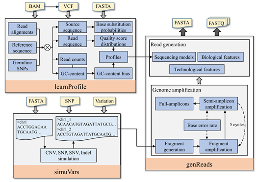

# SCSsim

SCSsim is a tool designed for emulating single-cell genome sequencing data. It consists of three modules: 1) “simuVars” module aims to generate single cell genome from a given reference sequence by inserting user-defined genomic variations into genomic loci; 2) “learnProfile” component is developed to infer sequencing platform dependent profiles from real data; 3) “genReads” utility is provided to mimic single-cell genome amplification and read generation procedures based on the results of “simuVars” and “learnProfile”. More details about the software can be found from [here](https://github.com/qasimyu/scssim/tree/master/docs/SCSsim_User_Guide.pdf).



## Requirements

* Linux systems.
* CMake2.8+.
* g++.

## Installation

To build binary, do as follows:

```
tar -zxvf SCSsim.tar.gz
cd SCSsim
cmake .
make
```

After the installation, the main programs of SCSsim are generated in “bin” directory. Type following command if you want to add SCSsim to system path:
```
make install
```

## Usage

### Step 1: generate single cell genome sequence

Users can use “scssim simuvars” subcommand to simulate the genome sequence of single cell by defining various genomic variations. The types of variations include single nucleotide polymorphism (SNP), single nucleotide variation (SNV), short insert and deletion (indel), and copy number variation (CNV).

Example:

```
scssim simuvars -r ./testData/refs/ref.fa.gz -s ./testData/snps/snp.txt -v ./testData/vars/vars.txt -o ./results/simu.fa
```

### Step 2 (optional): infer sequencing profiles from real datasets

The “scssim learn” subcommand is designed to infer sequencing profiles from real sequencing data generated from Illumina instruments. In the current version, four profiles including indel error distributions, base substitution probabilities, Phred quality distributions and GC-content bias are measured. The profiles from several Illumina platforms are available in directory ./testData/models, and users can build their own profiles from a given real dataset using this program. 

Examples:

```
scssim learn -b <sample>.bam -t <targets>.bed -v <sample>.vcf -r <reference>.fa > <sample>.profile
scssim learn -b <sample>.bam -v <sample>.vcf -r <reference>.fa -o <sample>.profile –s /path/to/samtools
```

### Step 3: amplify single cell genome and generate reads

The “scssim genreads” subcommand is developed to simulate single-end or paired-end reads based on the results of “simuVars” and “learnProfile” modules. 

Example:

```
scssim genreads -i ./results/simu.fa -r 2e-10 -m ./testData/models/Illumina_HiSeq2500.profile -t 5 -o ./results/reads
```

## Citation

Please cite SCSsim in your publications if it helps your research:

``` bibtex
@incollection{yu2019scssim,
  author = {Zhenhua Yu, Fang Du, Xuehong Sun, Ao Li},
  title = {SCSsim: an integrated tool for simulating single-cell genome sequencing data},
  year = {2019, under review},
}
```

## Contact

If you have any questions, please contact zhyu@nxu.edu.cn.